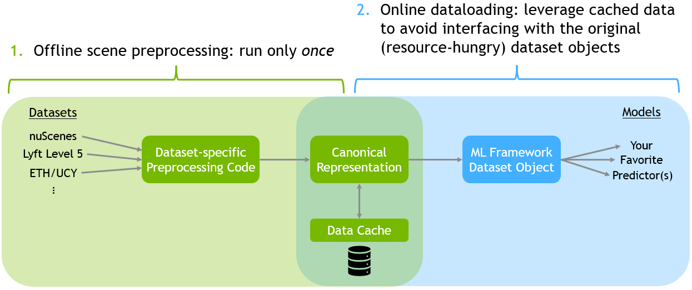

# Unified AV Data Loader

[](https://github.com/psf/black)
[](https://pycqa.github.io/isort/)

### Installation

First, in whichever environment you would like to use (conda, venv, ...), please install the required dependencies with
```
pip install -r requirements.txt
```
Then, download the raw datasets (nuScenes, Lyft Level 5, etc) somewhere onto your computer.

### Data Preprocessing
The dataloader operates via a two-stage process, visualized below.

First, you should preprocess data into a canonical format. This can be done as follows:
```
python preprocess_data.py
```
This will perform the first part of the architecture above and create data caches for each specified dataset.

### Data Loading
To actually load batches of data for training/evaluation/etc, please see `test.py` for an example.

At a minimum, data can be loaded with the following script:
```
import os
from torch.utils.data import DataLoader
from avdata import AgentBatch, UnifiedDataset

dataset = UnifiedDataset(desired_data=["nusc_mini, lyft_sample"])

dataloader = DataLoader(
    dataset,
    batch_size=64,
    shuffle=True,
    collate_fn=dataset.get_collate_fn(),
    num_workers=os.cpu_count(),
)

batch: AgentBatch
for batch in dataloader:
    # Train/evaluate/etc.
    pass
```

### Current Implementation
This is still an in-progress work, however many basic features are implemented. Take a look at [these slides](https://nvidia-my.sharepoint.com/:p:/g/personal/bivanovic_nvidia_com1/ERemy_e0hE9GuUsl-ZJBFfIBHDP0_q8JNG4Er5iOVaeCTw?e=Nhz9Kw) for an overview of the project and its current status.

In particular, the following has been implemented:

